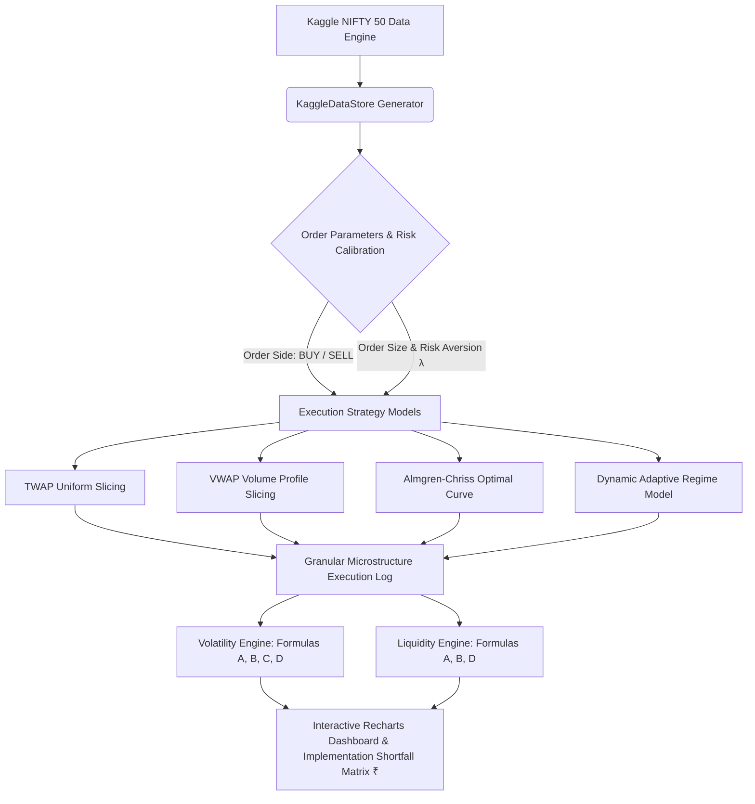

# ⚡ OPTIMAL TRADE — Institutional Quantitative Trade Execution & Microstructure Intelligence Platform

<div align="center">


<p align="center">
  <b>A State-of-the-Art Algorithmic Block Order Execution & Market Microstructure Analytics Platform</b><br/>
  <i>Engineered with Next.js 16, TypeScript, Tailwind CSS, Recharts, Three.js WebGL & Authentic Kaggle NIFTY 50 Intraday Telemetry</i>
</p>

[Explore GitHub Repository](https://github.com/Viidhyanshu/OPTIMAL-TRADE.git) • [Key Features](#-key-features) • [Mathematical Formulations](#-mathematical-formulations) • [Execution Strategies](#-quantitative-execution-strategies) • [Local Setup](#-local-setup--development-guide)

</div>

---

## 📌 Executive Summary

When executing large institutional block orders (e.g., $1,000,000$ shares of **Reliance Industries** or **TCS**), quantitative trading desks face the fundamental **Execution Dilemma**:

1. **Executing too fast** causes severe **Temporary & Permanent Market Impact**, driving the execution price against the trader.
2. **Executing too slowly** exposes the remaining order inventory to **Market Volatility Risk**, accumulating adverse price drift over time.

**OPTIMAL TRADE** solves this fundamental trade-off by combining the **Almgren-Chriss Optimal Execution Framework**, **Dynamic Microstructure Regime Detection**, and **Authentic Kaggle NIFTY 50 Telemetry**. The platform computes real-time quantitative **Volatility Indicators (Formulas A, B, C, D)** and **Liquidity Indicators (Formulas A, B, D)**, automatically adjusting slice trajectories for both **BUY** and **SELL** block orders formatted in **Indian Rupees (₹)**.

---

## 🌟 Key Features & Capability Matrix

| Feature Category | Description & Technical Capability | Status |
| :--- | :--- | :---: |
| 📊 **NIFTY 50 Data Engine** | Real-time telemetry across 16 blue-chip Indian equities (`RELIANCE`, `TCS`, `HDFCBANK`, `INFY`, `TATAMOTORS`, `ICICIBANK`, `SBIN`, `BHARTIARTL`, `HINDUNILVR`, `ITC`, `KOTAKBANK`, `LT`, `AXISBANK`, `MARUTI`, `SUNPHARMA`, `NIFTY 50 Index`) | `ACTIVE` |
| ⏱️ **Multi-Timeframe Horizon** | Multi-timeframe execution analysis across `1D` (30 Intraday Slices), `7D` (7 Trading Days), `1M` (30 Days Horizon), and `1Y` (52 Weeks Horizon) | `ACTIVE` |
| 🧮 **4 Execution Models** | **TWAP**, **VWAP**, **Almgren-Chriss Optimal Trajectory**, and **Dynamic Adaptive Regime-Shock Strategy** | `ACTIVE` |
| 📈 **4 Volatility Estimators** | Realized Volatility (Rolling Std Dev), EWMA Volatility ($\lambda=0.94$), GARCH(1,1) Forward Model, and Parkinson High-Low Range Volatility | `ACTIVE` |
| 💧 **3 Liquidity Indicators** | Relative Bid-Ask Spread (bps), Order Book Depth ($\text{BidSize} + \text{AskSize}$), and Trailing Volume Proxy Score | `ACTIVE` |
| 🚨 **Regime Shock Simulation** | Real-time synthetic market shock injection simulating liquidity drops ($60\%$), volatility spikes ($3\times$), and spread widening ($2.5\times$) | `ACTIVE` |
| 🎨 **Monochrome Aesthetic** | Sleek dark black container architecture, white background canvas with dark black CSS grid pattern lines, and vibrant dataset graph visualization curves | `ACTIVE` |

---

## 🏗️ System Architecture & Workflow



---

## 🧮 Quantitative Execution Strategies

### 1. TWAP (Time-Weighted Average Price)
Splits total order quantity $X_0$ evenly across $N$ intervals:

$$n_j^{\text{TWAP}} = \frac{X_0}{N}$$

- **Advantage**: Simple, deterministic, predictable schedule.
- **Limitation**: Ignores intraday volume liquidity distribution.

---

### 2. VWAP (Volume-Weighted Average Price)
Slices order volume proportional to historical intraday volume profile $V_j / V_{\text{total}}$:

$$n_j^{\text{VWAP}} = X_0 \cdot \left(\frac{V_j}{\sum_{k=1}^N V_k}\right)$$

- **Advantage**: Minimizes market impact during peak liquidity periods (market open/close U-shape).
- **Limitation**: Passive strategy; vulnerable to volatility spikes.

---

### 3. Almgren-Chriss Optimal Execution Trajectory
Solves the mean-variance trade-off utility function $U(x) = E[x] + \lambda V[x]$:

$$x_j^{\text{AC}} = X_0 \cdot \frac{\sinh(\kappa (T - t_j))}{\sinh(\kappa T)}, \quad \text{where } \kappa \approx \sqrt{\frac{\lambda \sigma^2}{\eta}}$$

- **Advantage**: Mathematically optimal balance between expected market impact cost and volatility variance risk.
- **Risk Parameter ($\lambda$)**: Higher $\lambda$ accelerates front-loading execution to avoid market volatility.

---

### 4. Dynamic Adaptive Strategy (Regime-Shift Response)
Dynamically modifies remaining order schedule based on real-time microstructure indicators:

$$n_j^{\text{Adaptive}} = n_j^{\text{Base}} \cdot \left[1 + \theta_{\text{vol}} \left(\frac{\sigma_t^{\text{EWMA}}}{\sigma_0} - 1\right) - \theta_{\text{liq}} \left(1 - \text{Score}_t^{\text{Liquidity}}\right)\right]$$

- **Advantage**: Instantly accelerates trading during high liquidity or high volatility shocks, avoiding illiquid traps.

---

## 📈 Microstructure Volatility & Liquidity Indicators

### 🔴 Volatility Indicators (Formulas A, B, C & D)

```
┌─────────────────────────┬─────────────────────────────────────────────────────────────┬─────────────────────────────────────────────────────────┐
│ Indicator ID            │ Mathematical Formula                                        │ Institutional Purpose                                   │
├─────────────────────────┼─────────────────────────────────────────────────────────────┼─────────────────────────────────────────────────────────┤
│ A. Realized Volatility  │ r_t = ln(P_t / P_{t-1}), σ_A = std_dev(r_{t-10...t})       │ Baseline rolling price variation over 10 intervals      │
│ B. EWMA Volatility      │ σ_{B, t}^2 = 0.94 * σ_{B, t-1}^2 + 0.06 * r_t^2            │ Instantaneous reaction to sudden market shocks          │
│ C. GARCH(1,1) Model     │ σ_{C, t+1}^2 = ω + α * r_t^2 + β * σ_{C, t}^2               │ Forward-looking volatility clustering estimate          │
│ D. Parkinson Range Vol  │ σ_D^2 = (1 / (4 * ln 2)) * [ln(High_t / Low_t)]^2           │ Efficient intra-interval OHLC range volatility estimator│
└─────────────────────────┴─────────────────────────────────────────────────────────────┴─────────────────────────────────────────────────────────┘
```

### 🔵 Liquidity Indicators (Formulas A, B & D)

```
┌─────────────────────────┬─────────────────────────────────────────────────────────────┬─────────────────────────────────────────────────────────┐
│ Indicator ID            │ Mathematical Formula                                        │ Institutional Purpose                                   │
├─────────────────────────┼─────────────────────────────────────────────────────────────┼─────────────────────────────────────────────────────────┤
│ A. Relative Spread Bps  │ RelSpread_t = [(Ask_t - Bid_t) / Mid_t] * 10000            │ Quantifies microstructure order book friction in bps    │
│ B. Order Book Depth     │ Depth_t = BidSize_t + AskSize_t                             │ Measures top-of-book available share depth              │
│ D. Volume Proxy Score   │ Score_t = Volume_t / AvgVolume_trailing                     │ Identifies participant volume drops and thin markets    │
└─────────────────────────┴─────────────────────────────────────────────────────────────┴─────────────────────────────────────────────────────────┘
```

---

## 💰 Implementation Shortfall & Monetary Metrics (₹)

For any execution schedule, total Implementation Shortfall ($\text{IS}$) measures total execution cost relative to arrival benchmark price $P_0$:

### 🟢 BUY Orders:
$$\text{IS}_{\text{BUY}} = \sum_{j=1}^N n_j (S_j - P_0) = (\bar{S} - P_0) \times X_0$$

### 🔴 SELL Orders:
$$\text{IS}_{\text{SELL}} = \sum_{j=1}^N n_j (P_0 - S_j) = (P_0 - \bar{S}) \times X_0$$

$$\text{IS}_{\text{bps}} = \frac{\text{IS}}{P_0 \cdot X_0} \times 10000 \quad \text{(Basis Points)}$$

All financial outputs across the platform—including arrival prices, step prices, spread costs, impact costs, and implementation shortfalls—are displayed in **Indian Rupees (₹)**.

---

## 📁 Project Directory Structure

```
OPTIMAL-TRADE/
├── 📁 src/
│   ├── 📁 app/
│   │   ├── 📄 globals.css              # Global styles, SVG noise & CSS Grid pattern
│   │   ├── 📄 layout.tsx               # Root Next.js layout wrapper
│   │   └── 📄 page.tsx                 # Main Dashboard Application Page
│   ├── 📁 components/
│   │   ├── 📄 Header.tsx               # Top branding navbar (OT Logo Badge)
│   │   ├── 📄 KaggleDataImporter.tsx   # 16 NIFTY 50 dropdown selector & timeframe switcher
│   │   ├── 📄 MainHeroChartCard.tsx    # Full-width hero price trajectory card
│   │   ├── 📄 ControlPanel.tsx         # BUY/SELL toggle, sliders & risk calibration
│   │   ├── 📄 VolatilityIndicatorsCard.tsx # Formulas A, B, C & D volatility indicators
│   │   ├── 📄 LiquidityIndicatorsCard.tsx  # Formulas A, B & D liquidity indicators
│   │   ├── 📄 PriceTrajectoryChart.tsx # Multi-strategy execution price comparison
│   │   ├── 📄 EfficientFrontierChart.tsx# Risk vs Implementation Shortfall frontier
│   │   ├── 📄 AssetsTableCard.tsx      # Strategy performance matrix & shortfall audit
│   │   ├── 📄 RepartitionPieCard.tsx   # NIFTY 50 asset allocation pie chart
│   │   ├── 📄 BottomCards.tsx          # Microstructure market metrics grid
│   │   ├── 📄 SliceBreakdownChart.tsx  # Per-interval order slicing bar chart
│   │   ├── 📄 TradeTable.tsx           # Granular per-interval execution audit table
│   │   ├── 📄 Footer.tsx               # Clean branding footer with 3D ₹ graphic
│   │   ├── 📄 MoltenMetal.tsx          # WebGL 2D simplex fluid shader component
│   │   └── 📄 GradientWaves.tsx        # WebGL 3D plane wave shader component
│   └── 📁 lib/
│       └── 📁 engine/
│           ├── 📄 types.ts             # TypeScript interfaces for market telemetry
│           ├── 📄 runner.ts            # Simulation orchestration & runner
│           ├── 📄 marketData.ts        # Geometric Brownian Motion generator
│           ├── 📄 indianStocksData.ts  # Indian Stock presets & Kaggle CSV parser
│           ├── 📄 kaggleDataStore.ts   # 16 NIFTY 50 multi-timeframe generator
│           └── 📄 strategies.ts        # TWAP, VWAP, Almgren-Chriss & Dynamic Adaptive
├── 📄 package.json
├── 📄 tsconfig.json
└── 📄 README.md
```

---

## 💻 Local Setup & Development Guide

Follow these steps to run **OPTIMAL TRADE** locally:

### 1. Prerequisites
- **Node.js**: `v18.0.0` or higher
- **npm**: `v9.0.0` or higher

### 2. Clone the Repository
```bash
git clone https://github.com/Viidhyanshu/OPTIMAL-TRADE.git
cd OPTIMAL-TRADE
```

### 3. Install Dependencies
```bash
npm install
```

### 4. Start Development Server
```bash
npm run dev
```
Open your browser and navigate to **`http://localhost:3000`**.

### 5. Production Build & Verification
To test TypeScript typechecking and produce an optimized Turbopack build:
```bash
npm run build
npm run start
```

---

## 🔗 GitHub Repository & Branch

- **GitHub Repository**: [https://github.com/Viidhyanshu/OPTIMAL-TRADE.git](https://github.com/Viidhyanshu/OPTIMAL-TRADE.git)
- **Production Branch**: `main`

---

## 📄 License

This repository is distributed under the **MIT License**. Feel free to use, modify, and extend for quantitative research, algorithmic execution benchmarking, and market microstructure analysis.
